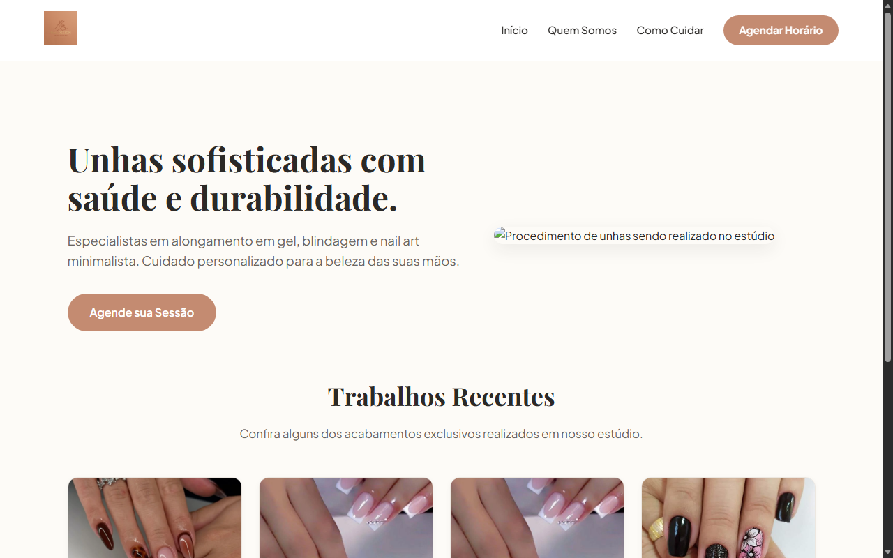

# Naildesign

Modelo de landing page multipágina para estúdio de manicure e estética de unhas.

Demo online: https://marcoserculianipw.github.io/naildesign/



## Sobre o projeto

Criei este projeto como estudo prático de desenvolvimento frontend para simular a presença online de um estúdio de beleza. O objetivo foi estruturar um site multipágina responsivo utilizando apenas HTML5 e CSS3 puros, sem dependência de bibliotecas externas ou frameworks.

## Páginas e funcionalidades

- **Início (`index.html`):** apresentação dos principais procedimentos (alongamento em gel, blindagem de diamante, nail art) e galeria de trabalhos recentes
- **Quem Somos (`quemsomos.html`):** história do espaço, perfil profissional e padrões de atendimento
- **Como Cuidar (`comocuidar.html`):** guia de recomendações e cuidados no pós-procedimento
- **Agendamento (`agendamento.html`):** formulário com validações nativas para solicitação de horário (nome, WhatsApp, serviço desejado, data e observações)

## Tecnologias

- HTML5 semântico
- CSS3 puro (Flexbox, CSS Grid e design responsivo)

## Como rodar localmente

Por ser um projeto estático, não há dependências de compilação ou execução:

1. Clone o repositório:
```bash
git clone https://github.com/marcoserculianipw/naildesign.git
```
2. Abra o arquivo `index.html` diretamente em seu navegador.
